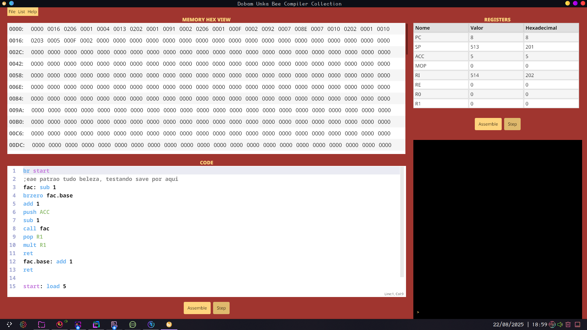

# DUBcc

## 🔥Dobam Unka Bee Compiler Collection

### Descrição

Trabalho realizado na disciplina de Programação de Sistemas na Universidade Federal de Pelotas no semestre 2025/1. Este trabalho consiste em desenvolver do zero uma computador hipotético, seguindo o livro do Calingaert, com poucas alterações. O trabalho possui interface gráfica pŕopria, além do executor (emulador). Este projeto foi desenvolvido na linguagem Go, como foi definido em aula.

> Trabalho em desenvolvimento...

## 🏆️ Progresso
- [x] Máquina Virtual
- [x] Montador
- [x] Processador de Macros
- [ ] Carregador
- [ ] Ligador

## 💻 Pré-requisitos

Para testar o programa desenvolvido, certifique-se que possua:

-  Linguagem Go
- Sistema operacional Windows ou Linux

### 💻 Executando
Placeholder

### 🤝 Membros do Grupo
Líder
- Pedro Porto Souza

Vice-Líder
- Stephan Heidmann

Membros
- Rafael Caetano
- Kevin Rehbein
- Marlon Weber
- Lorenzo Saldanha
- Guilherme Ganassini
